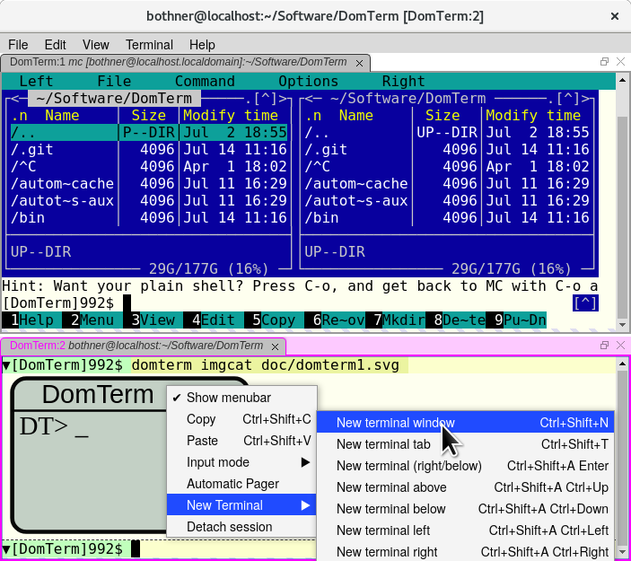

# Menus in JavaScript

This is a library for menus (both menubars and context-menus),
implemented using plain JavaScript. It should work in all modern browsers
without requiring any special permissions or server support.
The API is similar (and mostly compatible) with that of NWJS and Electron.
It is based on Sam Wray's [mwjs-menu-browser](https://github.com/2xAA/nwjs-menu-browser) library.

This makes possible applications that look and feel like native
applications, using web APIs (HTML, JavaScript, CSS, DOM),
without the overhead of something like Electron.
You can use any "embedded" bare-bones web browser, including
the Chrome browser with the `--app` option.

As an example, the [DomTerm](https://domterm.org) terminal emulator
has a "back-end" written in C, which communicates (using http and
websockets) with any modern browser.  It can optionally run under
Electron, and the code for creating menus (see `hlib/domterm-menus.js`)
is mostly the same whether using Electron to create menus, or using this
library in a generic browser.

Advantages and changes compared to the original `mwjs-menu-browser`:

* Menu-items and menus can be shared between menus.
* Keyboard navigation (using arrow keys, Escape, and Enter).
* Some changes to work better with libraries such as GoldenLayout
(for panes and tab) and full-screen.
* You need to explicitly call `Menu.setApplicationMenu`
(like Electron) - creating the Menu objects is not sufficient.
* Passes MenuItem as (first) argument to click handler (like Electron).
* Support `visible` property on MenuItems (like Electron).
* Support `accelerator` property (like Electron) as an alternative to
`key` plus `modifiers`.
* Polishing so it works more like other menu systems, including
various bug fixes, and working smoothly under Firefox.
* Styling changes to make it look more native-looking (on Linux or Windows);
this is probably a regression on Mac (needs testing).
* Internal changes, such as when a menu is no longer shown, we remove
its elements, rather than just hiding it with css.

### Using

Just load or require `jsMenus.js` and `jsMenus.css`.

There is API documentation in Documentation.md.

### Demo/example

The file [demo.html](./demo.html) shows many of the features.
You can run it in-place after cloning it.
You can also [view it directly on GitHub](https://rawgit.com/PerBothner/jsMenus/master/demo.html) using rawgit.

### Screenshots

This shows the context menu for the [DomTerm terminal emulator](https://domterm.org).
DomTerm is started using the `--chrome-app` flag,
which starts the Google Chrome browser in "application mode",
without the default "chrome" (location bar etc).

### TODO
* Test and polish style on multiple platforms, including MacOS.
* Internal cleanup - Menu or MenuItem should not have properties
that depend on display/navigation state. Specifically, there
should be no pointersMto the parent or DOM node, not even temporarily.
